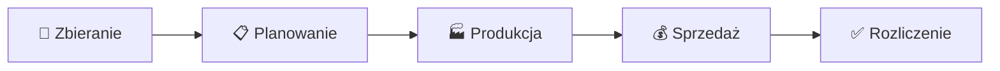

# 🥩 Wędlinka — System Zarządzania Masarnią

**Wędlinka** to nowoczesna, lekka i progresywna aplikacja webowa (PWA) przeznaczona do kompleksowego zarządzania procesami w masarni rzemieślniczej. System wspiera cały cykl produkcyjno-sprzedażowy: od zbierania zamówień od klientów, przez planowanie zapotrzebowania na surowce i produkcję, aż po korekty wagi, wydawanie towarów, płatności i raporty finansowe.

Aplikacja została zaprojektowana jako jednostronicowa aplikacja (SPA) działająca bezpośrednio w przeglądarce, zsynchronizowana w czasie rzeczywistym z bazą danych **Firebase Cloud Firestore**.

---

## 🛠️ Stos Technologiczny

- **Frontend**: Czysty HTML5, CSS3 (zmienny motyw Dark/Light) oraz JavaScript (ES Modules, SPA Router z lazy-loadingiem).
- **Backend (Baza danych & Auth)**: Google Firebase v10.12.0 (Firestore + Authentication via Google Sign-In).
- **PWA (Offline Support)**: Service Worker z wersjonowanym systemem pamięci podręcznej (Cache Storage).
- **Brak procesu budowania**: Projekt uruchamia się bezpośrednio z plików źródłowych, bez konieczności instalowania Webpacka, Vite czy npm (dzięki ładowaniu bibliotek Firebase bezpośrednio z CDN).

---

## 📁 Struktura Projektu

```
05_Wedlinka_app/
├── index.html           # Główny szkielet aplikacji (App Shell) i ekran logowania
├── cennik.html          # Publiczny podgląd cennika (dostępny bez logowania)
├── manifest.json        # Manifest PWA (instalacja na telefonie/pulpicie)
├── service-worker.js    # Mechanizm pamięci podręcznej i pracy offline (cache v9)
├── firestore.rules      # Reguły zabezpieczeń i dostępu do bazy Firestore
├── icons/               # Zasoby graficzne i ikony PWA
├── css/
│   └── style.css        # Kompletny arkusz stylów CSS (Design System)
└── js/
    ├── firebase-config.js # Konfiguracja połączenia z Firebase
    ├── auth.js           # Obsługa logowania Google Auth
    ├── db.js             # Warstwa dostępu do danych (Firestore CRUD i nasłuchy)
    ├── app.js            # Router, modale, toast-y, helpery (escHtml, formatDate, itp.)
    └── modules/          # Niezależne moduły SPA (ładowane dynamicznie)
        ├── dashboard.js  # Pulpit główny (statystyki i przegląd)
        ├── szarze.js     # Tworzenie i przełączanie faz szarż produkcyjnych
        ├── klienci.js    # Kartoteka klientów z funkcją autozapisu i synchronizacji
        ├── zamowienia.js # Zbieranie zamówień, zapotrzebowanie, lista dostaw
        ├── produkcja.js  # Plan produkcji, zapotrzebowanie na surowce i zakupy
        ├── sprzedaz.js   # Korekta wag wydawanych, rejestracja płatności, cofanienie
        ├── raporty.js    # Finanse, zestawienia kosztów, wykresy SVG porównawcze
        └── placeholder.js# Szablon ekranów w budowie (pomocniczy)
```

---

## 🔄 Przepływ Biznesowy (Fazy Szarży)

Aplikacja opiera się na koncepcji **Szarży produkcyjnej**. Każda szarża przechodzi przez 5 kolejnych faz życia:



1. **Zbieranie zamówień**: Klienci składają zamówienia. Tylko w tej fazie można dodawać i edytować zamówienia w module *Zamówienia*.
2. **Planowanie produkcji**: Generowane jest zestawienie zbiorcze zapotrzebowania na produkty oraz wyliczana lista zakupów (np. mięso, przyprawy, jelita).
3. **Produkcja**: Masarnia przetwarza surowce i wytwarza produkty.
4. **Sprzedaż / Wydawanie**: Klienci odbierają towary (lub są one rozwożone). W tej fazie następuje korekta rzeczywistej wagi (np. z dokładnością do pęta kiełbasy) oraz rejestracja płatności (Gotówka / Przelew / Nieopłacone).
5. **Rozliczenie**: Podsumowanie zysków, kosztów i analiza marży. Po zamknięciu, szarżę można zarchiwizować.

---

## 📑 Opis Modułów Aplikacji

### 1. Pulpit (Dashboard)
- Szybki przegląd aktualnej aktywnej szarży oraz jej obecnej fazy.
- **Kluczowe statystyki**: liczba zamówień, szacunkowa wartość finansowa, liczba dostaw do zrealizowania (dla klientów z opcją dowozu), liczba zarejestrowanych klientów.
- Szybkie skróty do najczęstszych akcji oraz podgląd ostatnich 5 złożonych zamówień.

### 2. Szarże
- Zarządzanie cyklem produkcyjnym. Możliwość tworzenia nowej szarży, ustawiania planowanej daty produkcji i odbioru.
- Panel sterowania fazami aktywnej szarży (np. przejście ze zbierania do planowania).
- Moduł archiwum umożliwiający przeglądanie historycznych, zamkniętych szarż.

### 3. Klienci
- Baza danych klientów (imię, nazwisko, telefon, preferowany sposób odbioru: Odbiór własny / Dowóz, adres dostawy, znacznik stałego klienta).
- Inteligentne formatowanie wpisywanego telefonu (`XXX XXX XXX`).
- **Autosynchronizacja**: Zmiana danych klienta (np. numeru telefonu lub adresu) w tym module automatycznie aktualizuje te dane we wszystkich istniejących zamówieniach powiązanych z tym klientem w bazie (zapewnia to spójność w kartach dostaw i na panelu sprzedaży).

### 4. Zamówienia
- Zbieranie zamówień przypisanych do aktywnej szarży.
- **Formularz zamówienia**: wybór klienta z listy (automatyczne ukrywanie klientów, którzy mają już przypisane zamówienie w danej szarży), szybki kreator ilości produktów (+ / -), znacznik zamówienia spóźnionego oraz notatki.
- **Zapotrzebowanie**: Zbiorcze zestawienie ile łącznie sztuk/kilogramów każdego produktu należy przygotować.
- **Lista dostaw**: Podział na zamówienia "Do dowozu" (z adresem i telefonem oraz opcją szybkiego oznaczenia jako dostarczone) oraz "Dostarczone".

### 5. Produkcja
- **Lista Produkcji**: Przeliczenie zapotrzebowania z zamówień z uwzględnieniem dodatkowego zapasu produkcyjnego (bufora procentowego).
- **Lista Zakupów**: Automatyczny kalkulator surowców potrzebnych do produkcji na podstawie wbudowanych receptur (ilość mięsa klasyfikowanego, przypraw, jelit itp.).
- **Notatki produkcyjne**: Miejsce na zapiski technologiczne dla masarza.

### 6. Sprzedaż
- Ekran przeznaczony dla punktu wydawania towaru.
- **Korekta wagi**: Możliwość wpisania rzeczywistej wagi wydanego produktu (zamiast wagi zamówionej) — opcja dostępna zarówno dla zamówień oczekujących, jak i już wydanych.
- **Statusy płatności**: Oznaczenie zamówienia jako opłacone (Gotówka / Przelew) lub nieopłacone.
- **Funkcja "Cofnij"**: Opcja cofnięcia błędnie wydanego zamówienia z powrotem do stanu oczekującego.
- Paski podsumowań finansowych: całkowita wartość szarży, kwota zapłacona oraz kwota pozostała do zapłaty.

### 7. Raporty
- Finansowe podsumowanie wybranej szarży.
- Wprowadzanie rzeczywistych kosztów produkcji (mięso, przyprawy, jelita, inne koszty).
- Automatyczne wyliczenie przychodu, marży kwotowej oraz procentowej rentowności szarży.
- Tabela należności (lista klientów z nieopłaconymi zamówieniami wraz z ich telefonami ułatwiająca kontakt).
- **Porównanie szarż**: Interaktywny wykres słupkowy SVG generowany dynamicznie w przeglądarce, pokazujący przychody i zyski na przestrzeni ostatnich szarż.

---

## 🗄️ Model Danych (Struktura Firestore)

### Kolekcja: `produkty`
```json
{
  "nazwa": "Kiełbasa Swojska",
  "kategoria": "Kiełbasy",
  "cena": 39.90,
  "jednostka": "kg",
  "aktywny": true,
  "createdAt": Timestamp,
  "updatedAt": Timestamp
}
```

### Kolekcja: `klienci`
```json
{
  "imie": "Jan",
  "nazwisko": "Kowalski",
  "telefon": "500 600 700",
  "dostawa": true,
  "adresDost": "ul. Leśna 5, Pcim",
  "stalKlient": true,
  "createdAt": Timestamp,
  "updatedAt": Timestamp
}
```

### Kolekcja: `szarze`
```json
{
  "nazwa": "Szarża Wielkanocna 2026",
  "dataProdukcji": Timestamp,
  "dataOdbioru": Timestamp,
  "faza": "sprzedaz",
  "zarchiwizowana": false,
  "createdAt": Timestamp,
  "updatedAt": Timestamp
}
```

### Kolekcja: `zamowienia`
```json
{
  "szarzaId": "ID_SZARZY",
  "klientId": "ID_KLIENTA",
  "klientImie": "Jan",
  "klientNazwisko": "Kowalski",
  "klientTelefon": "500 600 700",
  "klientDostawa": true,
  "klientAdres": "ul. Leśna 5, Pcim",
  "status": "wydano",
  "spoznione": false,
  "platnosc": "gotowka",
  "notatki": "Odbiór po południu",
  "pozycje": [
    {
      "produktId": "ID_PRODUKTU",
      "produktNazwa": "Kiełbasa Swojska",
      "jednostka": "kg",
      "cena": 39.90,
      "ilosc": 2.0,
      "iloscWydana": 2.15
    }
  ],
  "createdAt": Timestamp,
  "updatedAt": Timestamp
}
```

### Kolekcja: `koszty`
```json
{
  "szarzaId": "ID_SZARZY",
  "mieso": 450.00,
  "przyprawy": 50.00,
  "jelita": 80.00,
  "inne": 30.00,
  "createdAt": Timestamp
}
```

---

## 🔒 Bezpieczeństwo i Uprawnienia

Dostęp do bazy danych regulują reguły **Cloud Firestore Security Rules** (`firestore.rules`):
- Katalog produktów (`/produkty`) jest dostępny publicznie do odczytu (dzięki temu działa publiczny cennik w `cennik.html`).
- Wszelkie operacje zapisu w produktach oraz **pełen dostęp (odczyt i zapis)** do pozostałych kolekcji (`klienci`, `szarze`, `zamowienia`, `koszty`) wymagają poprawnego uwierzytelnienia przez Firebase Auth (zalogowanie kontem Google).

---

## 💻 Uruchomienie Lokalne

Projekt wymaga lokalnego serwera HTTP do poprawnego działania importów modułów ES (uniknięcie błędów CORS).

### Sposób A (Gdy masz zainstalowany Python - zalecane)
Otwórz terminal w folderze projektu i uruchom:
```powershell
python -m http.server 3001
```
Aplikacja będzie dostępna pod adresem: **http://localhost:3001**

### Sposób B (Gdy masz zainstalowane Node.js/npm)
Uruchom w folderze projektu:
```powershell
npx serve -l 3001
```
Aplikacja będzie dostępna pod adresem: **http://localhost:3001**

---

## 🌐 Hosting na GitHub Pages

Aplikacja jest przystosowana do darmowego hostingu na **GitHub Pages** (w oparciu o publiczne repozytorium na GitHub).

### Procedura Aktualizacji Kodu (Deployment)
Po wprowadzeniu zmian w lokalnych plikach, wgraj je na GitHub wykonując w konsoli:
```powershell
git add .
git commit -m "Opis wprowadzonych zmian"
git push origin main
```
GitHub Pages automatycznie zaktualizuje aplikację online w ciągu 1-2 minut.

### ⚠️ Wymagana konfiguracja po stronie Firebase
Aby logowanie Google działało na nowej domenie hostingowej, musisz dodać ją do listy autoryzowanych domen:
1. Otwórz [Firebase Console](https://console.firebase.google.com).
2. Przejdź do: **Authentication** -> zakładka **Settings**.
3. W sekcji **Authorized domains** kliknij **Add domain**.
4. Wpisz swoją domenę bez protokołu (np. `TWÓJ-LOGIN.github.io` lub domeny Netlify/własne).
5. Kliknij **Add**.

---

## 🔄 Aktualizacja PWA w przeglądarkach użytkowników

Aplikacja korzysta z Service Workera. Przeglądarki klientów zapisują pliki JS w pamięci podręcznej. Aby zmusić przeglądarkę do pobrania najnowszej wersji kodu po aktualizacji:
1. Otwórz plik `service-worker.js`.
2. Zwiększ wersję w zmiennej `CACHE_NAME` (np. zmień `wedlinka-v9` na `wedlinka-v10`).
3. Zaktualizuj listę plików w tablicy `ASSETS_TO_CACHE` jeśli doszły nowe pliki.
4. Zrób commit i push na GitHub.
5. Użytkownicy powinni wykonać pełne odświeżenie strony (Ctrl + Shift + R) lub wyczyścić pamięć podręczną przeglądarki, jeśli zmiany nie są widoczne od razu.
